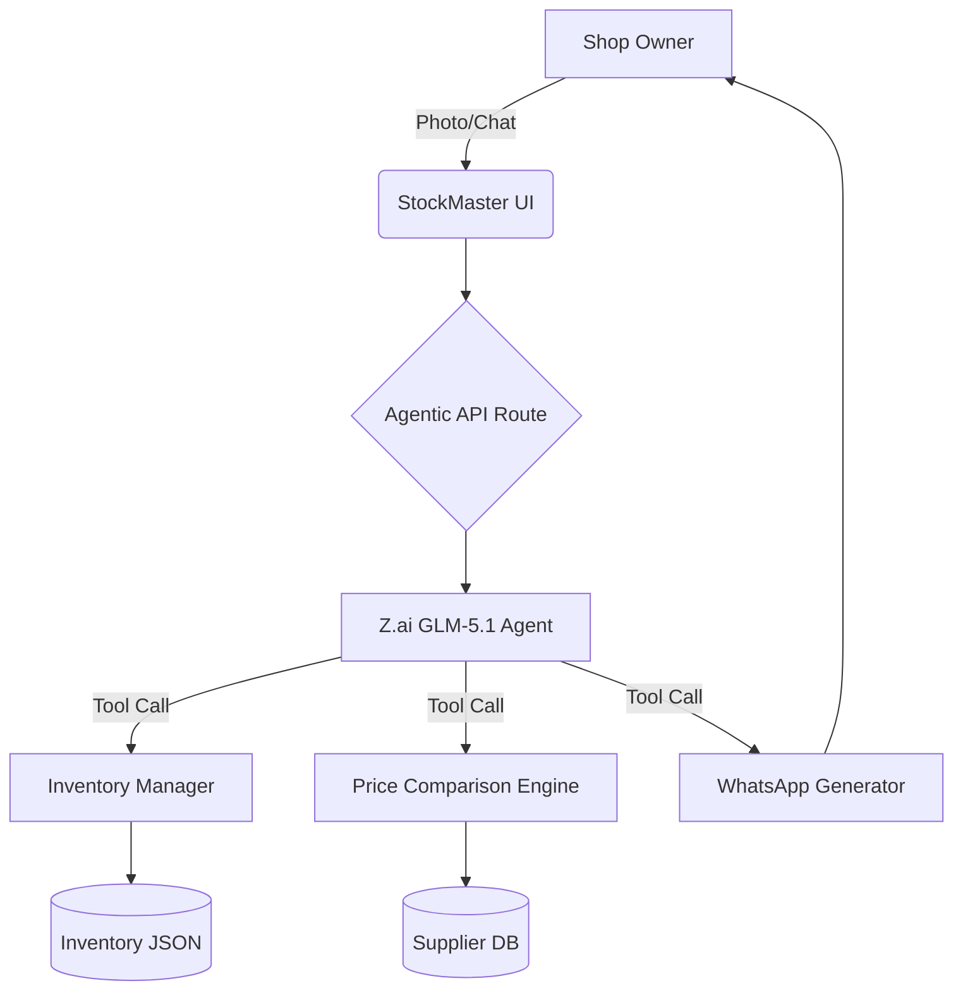

# 🧋 StockMaster AI
### *The Autonomous Procurement Agent for Malaysia's Milk Tea Scene*

[**🎥 Watch the Demo Video**](https://drive.google.com/file/d/1FN5u_iEApc_oivPNIpynPyftf53pYV0c/view?usp=sharing)

[](https://nextjs.org/)
[-blue)](https://open.bigmodel.cn/)
[](https://opensource.org/licenses/MIT)

---

## 🌟 The Problem
Small milk tea shop owners in Malaysia often struggle with **manual inventory tracking**, leading to:
- 📉 **Waste**: Over-ordering perishables like pearls and milk.
- ❌ **Stock-outs**: Losing sales during peak hours because they forgot to order from suppliers.
- 🗣️ **Language Barriers**: Complexity in communicating with diverse suppliers using Manglish/Malay.

## 🚀 The Solution: StockMaster AI
**StockMaster AI** is an intelligent assistant that acts as a bridge between the physical fridge and the supplier's WhatsApp. It doesn't just track data; it **takes action**.

### ✨ Key Features
- **📸 Smart Vision Analysis**: Just snap a photo of your fridge. Our `glm-4.5v` vision model detects low stock (milk cartons, syrup bottles) automatically.
- **🤖 Autonomous Agentic Workflow**: Unlike simple chatbots, StockMaster uses **Function Calling (Tool Use)** to interact with your live inventory system. It can check stock, compare prices, and restock items autonomously.
- **💬 Localized AI**: Handles **Manglish/Malay** queries naturally. "Eh, susu dah nak habis, tolong order" is perfectly understood.
- **⚖️ Automated Price Comparison**: Scans multiple supplier lists, normalizes units (kg vs L), and finds the **Optimal Supplier** to maximize profit margins.
- **📱 One-Click WhatsApp Ordering**: Automatically drafts a professional order and opens WhatsApp for instant sending.
- **📊 Real-time Dashboard**: Visual alerts for critical stock levels before they become a problem.

## 🛠️ Tech Stack
| Category | Technology |
| :--- | :--- |
| **Core Framework** | Next.js 15 (App Router), React 19, TypeScript |
| **AI Intelligence** | **Z.ai (Zhipu AI)** GLM-5.1 (Text/Agent) & GLM-4.5v (Vision) |
| **Backend Logic** | Tool-integrated API routes with hybrid NLP pre-processing |
| **Styling** | Tailwind CSS (Premium Dark Mode) |

## 🏗️ Architecture


## 🧠 Autonomous Tools
Our agent is equipped with a professional toolkit:
- `get_optimal_supplier`: Calculates the best unit price across all vendors.
- `get_recommended_restock`: AI-driven priority list for ordering.
- `restock_item`: Direct mutations to inventory levels.
- `generate_order_draft`: Localized WhatsApp message formatting.

## 🏃 Getting Started

### Prerequisites
- Node.js 18+
- Z.ai (Zhipu AI) API Key

### Installation
1. Clone the repo:
   ```bash
   git clone https://github.com/your-repo/stockmaster-ai.git
   ```
2. Install packages:
   ```bash
   npm install
   ```
3. Setup Environment:
   Create a `.env.local` file:
   ```env
   ZAI_API_KEY=your_key_here
   ZAI_BASE_URL=https://api.ilmu.ai/v1
   ```
4. Start Demo:
   ```bash
   npm run dev
   ```

## 🌍 Impact
By automating the tedious parts of inventory management, we allow shop owners to focus on what matters: **making great tea.** We estimate a **15% reduction in waste** and **5 hours saved per week** on procurement tasks.

## 👥 The Team
- **[Your Name/Team Name]** - Developers, Visionaries, and Milk Tea Enthusiasts.

---
*Created for UM Hackathon 2026*
